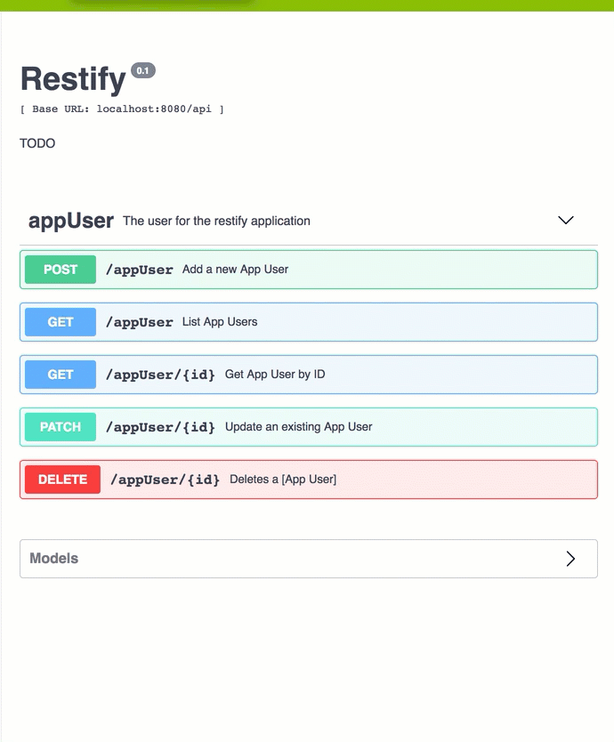

## A Grails Rest API in 60 seconds

Creat a new grails app ( this was done with 3.2.11 )
```
grails create-app restify --profile=rest-api
```

To use gorm-rest-api in Grails 3 you can specify the following configuration in build.gradle:

        dependencies {
            compile "org.grails.plugins:gorm-rest-api"
        }

create a domain

```
grails create-rest-domain restify.AppUser
```

This will create a domain in grails-app/domain/restify/ as well as an integration test.  
Edit AppUser and we'll add a few fields with descriptions and examples so our Swagger/OpenApi docs look good. This will also feed our [functional] tests


```groovy
package restify
import gorm.restapi.RestApi

@RestApi(description = "The user for the restify application")
class AppUser {
    String userName
    String magicCode
    String email
    
    Date dateCreated
    Date lastUpdated

    static constraints = {
        userName  description: 'The login name', 
                  example:"billy1",
                  nullable: false, maxSize:50
        magicCode description: 'The keymaster code. Some call this a password',
                  example:"b4d_p455w0rd", 
                  nullable: false
        email     description: "Email will be used for evil.",
                  example:"billy@gmail.com",
                  email:true, maxSize:50, nullable: true
    }

}
```

now run `grails test-app` to see the api exercised. 

## Lets try `run-app` with curl

**insert a user**
```bash
curl -i -X POST -H "Content-Type: application/json" -d '{"userName":"Joe", "magicCode": "Cool"}' localhost:8080/api/appUser
HTTP/1.1 201
X-Application-Context: application:development
Location: http://localhost:8080/api/appUser/1
Content-Type: application/json;charset=UTF-8
Transfer-Encoding: chunked
Date: Fri, 11 Aug 2017 07:34:05 GMT

{"id":1,"dateCreated":"2017-08-11T07:34:05Z","lastUpdated":"2017-08-11T07:34:05Z","magicCode":"Cool","userName":"Joe"}
```

**list users**
```bash
curl -i -X GET -H "Content-Type: application/json" localhost:8080/api/appUser
HTTP/1.1 200
--8<-- snipped ...

//FIME this should be showing pagination
[{"id":1,"dateCreated":"2017-08-11T07:34:05Z","lastUpdated":"2017-08-11T07:34:05Z","magicCode":"Cool","userName":"Joe"}]
```

**JSON Schema**

```json
curl -i localhost:8080/api/appUser/schema

{
    "$schema": "http://json-schema.org/schema#",
    "$id": "http://localhost:8080/api/schema/appUser#",
    "title": "AppUser",
    "Description":"The user for the restify application",
    "type": "Object",
    "required": [
        "userName",
        "magicCode"
    ],
    "properties": {
        "id": {
            "type": "integer",
            "readOnly": true
        },
        "version": {
            "type": "integer",
            "readOnly": true
        },
        "userName": {
            "title": "User Name",
            "description": "The login name",
            "example": "billy1",
            "type": "string",
            "required": true,
            "maxLength": 50
        },
        "magicCode": {
            "title": "Magic Code",
            "description": "The keymaster code. Some call this a password",
            "example": "b4d_p455w0rd",
            "type": "string",
            "required": true
        },
        "email": {
            "title": "Email",
            "description": "Email will be used for evil.",
            "example": "billy@gmail.com",
            "type": "string",
            "format": "email",
            "maxLength": 50
        },
        "lastUpdated": {
            "title": "Last Updated",
            "type": "string",
            "format": "date-time",
            "readOnly": true
        },
        "dateCreated": {
            "title": "Date Created",
            "type": "string",
            "format": "date-time",
            "readOnly": true
        }
    }
}
```

## OpenApi Swagger

Open a browser and go to http://localhost:8080/swagger.html


to see yml that feeds this check out localhost:8080/api/open-api.yml

```yaml
swagger: "2.0"
info:
  description: "TODO"
  version: "0.1"
  title: "Restify"
host: "localhost:8080"
basePath: "/api"
tags:
- name: "appUser"
  description: "The user for the restify application"
paths:
  /appUser:
    post:
      tags:
        - "appUser"
      summary: "Add a new App User"
      description: ""
      operationId: "create_appUser"
      parameters:
      - in: "body"
        name: "Object"
        description: "App User object to be created"
        required: true
        schema:
          $ref: "#/definitions/AppUser"
      responses:
        200:
          description: "success"
          schema:
            $ref: "#/definitions/AppUser"
        422:
          description: "Validation exception"
    get:
      tags:
      - "appUser"
      summary: "List App Users"
      operationId: "findAppUsers"
      responses:
        200:
          description: "successful operation"
          schema:
            type: "array"
            items:
              $ref: "#/definitions/AppUser"
        400:
          description: "Invalid status value"
  /appUser/{id}:
    get:
      tags:
      - "appUser"
      summary: "Get App User by ID"
      operationId: "get_appUserById"
      produces:
      - "application/json"
      parameters:
      - name: "id"
        in: "path"
        description: "ID of [AppUser] to return"
        required: true
        type: "integer"
        format: "int64"
      responses:
        200:
          description: "successful operation"
          schema:
            $ref: "#/definitions/AppUser"
        400:
          description: "Invalid ID supplied"
        404:
          description: "not found"
    patch:
      tags:
      - "appUser"
      summary: "Update an existing App User"
      description: ""
      operationId: "update_appUser"
      consumes:
      - "application/json"
      produces:
      - "application/json"
      parameters:
      - in: "body"
        name: "body"
        description: "AppUser object that needs to be updated"
        required: true
        schema:
          $ref: "#/definitions/AppUser"
      responses:
        400:
          description: "Invalid ID supplied"
        404:
          description: "not found"
        422:
          description: "Validation exception"
    delete:
      tags:
      - "appUser"
      summary: "Deletes a [App User]"
      description: ""
      operationId: "deleteAppUser"
      produces:
      - "application/json"
      parameters:
      - name: "id"
        in: "path"
        description: "id to delete"
        required: true
        type: "integer"
        format: "int64"
      responses:
        400:
          description: "Invalid ID supplied"
        404:
          description: "not found"
definitions:
  AppUser:
    type: "object"
    required:
    - "userName"
    - "magicCode"
    properties:
      id:
        type: "integer"
        format: "int64"
        readOnly: true
      userName:
        title: User Name
        description: The login name
        example: billy1
        type: string
        maxLength: 50
      magicCode:
        title: Magic Code
        description: The keymaster code. Some call this a password
        example: "b4d_p455w0rd"
        type: string
      email:
        title: "Email"
        description: Email will be used for evil.
        example: "billy@gmail.com"
        type: string
        format: email
        maxLength: 50
      lastUpdated:
        title: Last Updated
        type: string
        format: date-time
        readOnly: true
      dateCreated:
        title: Date Created
        type: string
        format: date-time
        readOnly: true

```

## Associations 

lets modify the App User to add an Org domain to it. 
We can also add a default static for the includes or excludes to pass to the renderer. includes accepts either a 
map or csv string in a SQL statement select like format.

```groovy
    ...
    Org org

    static constraints = {
        ...
        org       description: "The organization this user belongs to",
                  title: "Organization",
                  example:'{"id":1}',
                  nullable: false
    }
    
    static includes = "*, org.num, org.name"

}
```

create the Org and then add some fields to it

```groovy
package restify
import gorm.restapi.RestApi

@RestApi(description = "The _organizations_ and _tribes_ we all belong to")
class Org {
    String num
    String name
    String address

    static constraints = {
        num   description: 'identifier or nickname', 
              example:"vg1",
              maxSize:10, nullable: true
        name  description: 'Name of this organizatoin', 
              example:"Virgin Galactic",
              maxSize:50, nullable: false
        address description: 'Name of this organizatoin', 
                example:"123 Main St.\nAnyTown, WI 60456",
                maxSize:255, nullable: true
    }
}
```

//TODO show curl show and list on AppUser shows org.num and org.name

//TODO show curl -i localhost:8080/api/appUser/schema has Org object reference


